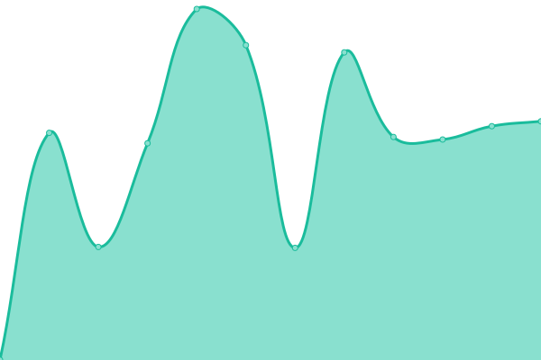

# [📈 Live Status](https://jobsonlook.github.io/ttt-upptime): <!--live status--> **🟧 Partial outage**

This repository contains the open-source uptime monitor and status page for [Upptime](https://upptime.js.org), powered by [Upptime](https://github.com/upptime/upptime).

With [Upptime](https://upptime.js.org), you can get your own unlimited and free uptime monitor and status page, powered entirely by a GitHub repository. We use [Issues](https://github.com/upptime/upptime/issues) as incident reports, [Actions](https://github.com/jobsonlook/ttt-upptime/actions) as uptime monitors, and [Pages](https://jobsonlook.github.io/ttt-upptime) for the status page.

<!--start: status pages-->
<!-- This summary is generated by Upptime (https://github.com/upptime/upptime) -->
<!-- Do not edit this manually, your changes will be overwritten -->
<!-- prettier-ignore -->
| URL | Status | History | Response Time | Uptime |
| --- | ------ | ------- | ------------- | ------ |
|  data-ens-indexer | 🟩 Up | [data-ens-indexer.yml](https://github.com/jobsonlook/ttt-upptime/commits/HEAD/history/data-ens-indexer.yml) | 

 591ms
     
 | 

<a href="https://jobsonlook.github.io/ttt-upptime/history/data-ens-indexer">100.00%</a>
    

|  data-crypto-event | 🟩 Up | [data-crypto-event.yml](https://github.com/jobsonlook/ttt-upptime/commits/HEAD/history/data-crypto-event.yml) | 

 66ms
     
 | 

<a href="https://jobsonlook.github.io/ttt-upptime/history/data-crypto-event">100.00%</a>
    

|  data-twitter-tips | 🟥 Down | [data-twitter-tips.yml](https://github.com/jobsonlook/ttt-upptime/commits/HEAD/history/data-twitter-tips.yml) | 

 61ms
     
 | 

<a href="https://jobsonlook.github.io/ttt-upptime/history/data-twitter-tips">0.00%</a>
    

|  msk-connector | 🟩 Up | [msk-connector.yml](https://github.com/jobsonlook/ttt-upptime/commits/HEAD/history/msk-connector.yml) | 

 2101ms
     
 | 

<a href="https://jobsonlook.github.io/ttt-upptime/history/msk-connector">100.00%</a>
    

|  glue | 🟩 Up | [glue.yml](https://github.com/jobsonlook/ttt-upptime/commits/HEAD/history/glue.yml) | 

 767ms
     
 | 

<a href="https://jobsonlook.github.io/ttt-upptime/history/glue">100.00%</a>
    

<!--end: status pages-->

[**Visit our status website →**](https://jobsonlook.github.io/ttt-upptime)

## 📄 License

- Powered by: [Upptime](https://github.com/upptime/upptime)
- Code: [MIT](./LICENSE) © [Upptime](https://upptime.js.org)
- Data in the `./history` directory: [Open Database License](https://opendatacommons.org/licenses/odbl/1-0/)
